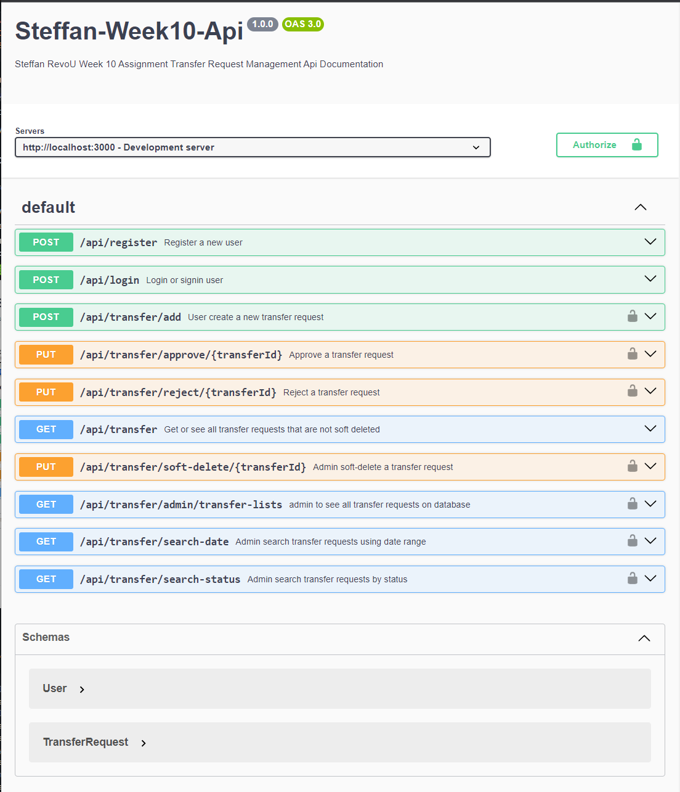

# A Simple Transfer Request Management Api Server

### Technology Used:

<p align="left">    


                
</p>

## Brief Description

#### About tools:

Express.js, commonly referred to as Express, is a minimal and flexible web application framework for Node.js, a runtime environment that allows developers to execute JavaScript code server-side. Express.js provides a set of tools and features that make it easier to build web applications and APIs. MongoDB stores data in a flexible, JSON-like format called BSON (Binary JSON) and offers features like automatic sharding for horizontal scaling, powerful querying through a flexible query language, and support for geospatial data. It's widely used in web development, mobile apps, and other scenarios where fast, adaptable data storage is essential.

#### Assignment Purpose:

This project is made for RevoU assignment.<br>
The purpose of this assignment is to create a sophisticated Transfer Request Management Api. The Api endpoints will facilitate the interaction between two roles "maker" and "approver" in which each roles will have it own purposes. The api will also have security and integrity using JWT.

#### About this app:

This transfer request management app is made using javascript, express, mongoDB as a database.

- App Features:
  - User Registration:
    - Anyone can register with a field `username, email, password, role`.
    - `username` must not be blank and each `username` is unique.
  - Password Requirements:
    - Each user password must have a minimum length of 8 chars.
    - Is alphanumeric
    - Is hashed when storing in MongoDB database.
  - Authentication & Authorization:
    - Using JWT to authenticated specific endpoints & manage role based control.
  - Roles:
    - User with `'maker'` role only able to create or add transfer request.
    - The status of transfer request created is automatically set to `'pending'`
    - User with `'approver'` role able to create, and `approve` or `reject` transfer request that has `pending` status.
    - Anyone without authentication and role authorization will be able to view all the transfer lists that is not soft-deleted.
    - User with `'admin'` role able to create, approve, and soft-delete the transfer request with status `'pending'` only not `'approved'` or `'rejected'`
    - `admin` role also able to see all the transfer requests available on the database without filtering the soft-delete method.
    - `admin` role also able to search or get all transfer request based on `date-range` & `multiple-statuses`

#### Guide to use this app

1. Git clone this repository.
2. Open the project and start with `npm install`, this will install all dependencies.
3. Create your own `.env` file (this will contain sensitive data or variables for your project.)
   - Below is the example:

```env
PORT=your_defined_port
MONGODB_URI=your_mongodb_uri
JWT_SECRET=your_jwt_secret
```

4. Run `npm start` to start the project, you will get a notification like this `Server listening on port PORT_NUMBER` & `Successfully connect to MongoDb`
5. Now you have successfully run the project.
6. Try and see the api-documentation by accessing `localhost:PORT_NUMBER/api-docs`

### Deployment

#### This project is deployed using railway.app
If you want to test and see this app api-endpoint and its functionality as mentioned in `app features` above, you can visit the link below <br>
### You can access the api-documentation here : [Link Here!](https://transfer-management-app-production.up.railway.app/api-docs/)
[View openapi.yaml here](./src/doc/openapi.yaml)<br>
**Notes: When registering the role accepted is either maker, approver, or admin.**<br>
Don't Forget to switch the `Server` to deployment or production.




#### Based on app featured discussed above: below is the routings for role-based access control
- Refer to `src/routes/transferRoutes.js`
```javascript
//Only authenticated user or user with bearer token can create transfer request
router.post("/add", body("amount").trim(), verifyJWT, createTransfer);
//only authenticated approver can approve and reject a a pending request
router.put("/approve/:transferId", verifyJWT, checkRole(["approver", "admin"]), approveTransferReq);
router.put("/reject/:transferId", verifyJWT, checkRole(["approver"]), rejectTransferReq);
//Any visitors or users can access this
router.get("/", getAllTransfers);
//admin area
router.put("/soft-delete/:transferId", verifyJWT, checkRole(["admin"]), softDeleteTransferReq);
router.get("/admin/transfer-lists", verifyJWT, checkRole(["admin"]), adminGetAllTransfers)
router.get("/search-date", verifyJWT, checkRole(["admin"]), getTransferReqByDateRange,);
router.get("/search-status", verifyJWT, checkRole(["admin"]), getTransferReqByStatuses);
```

[](https://classroom.github.com/a/zrfmWHEN)
